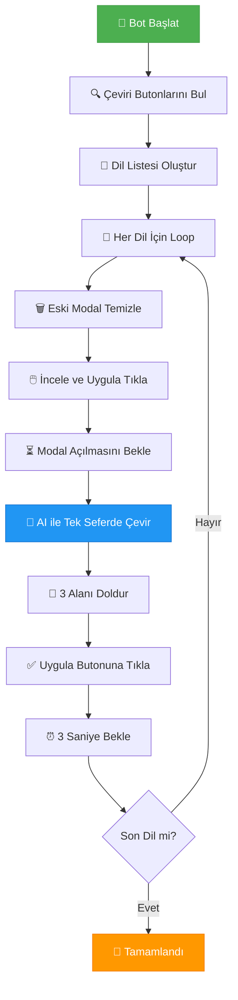

# 🚀 Google Play Store Çeviri Bot

<div align="center">


**🤖 Google Play Console için AI destekli otomatik çeviri asistanı**

*Tek tıkla tüm dillerde çeviri yapın, zamandan tasarruf edin!*

</div>

---

## ✨ Özellikler

<table>
<tr>
<td width="50%">

### 🤖 **Tam Otomatik Bot**
- Selenium benzeri otomasyonla çalışır
- Tüm dilleri sırayla işler
- Rate limiting koruması
- Hata durumunda otomatik retry

### ⚡ **Optimize Performans**
- Tek API çağrısı ile 3 alan çevirisi
- 30 saniye rate limit recovery
- Modal temizleme sistemi
- Real-time progress tracking

</td>
<td width="50%">

### 🧠 **AI Destekli Çeviri**
- Google Gemini API entegrasyonu
- JSON tabanlı structured response
- Karakter limiti kontrolü
- Çoklu format parsing

### 📱 **Modern UI/UX**
- Chrome Side Panel desteği
- Responsive tasarım
- Real-time bot durumu
- İşlenen diller listesi

</td>
</tr>
</table>

---

## 🎯 Nasıl Çalışır



---

## ⚙️ Kurulum

### 📥 **1. Proje İndirme**

```bash
git clone https://github.com/yusuf-polat/google-play-translate-bot.git
cd google-play-translate-bot
```

### 🔧 **2. Chrome'a Yükleme**

1. Chrome'da `chrome://extensions/` adresine gidin
2. **Developer mode**'u aktif edin (sağ üst köşe)
3. **"Load unpacked"** butonuna tıklayın
4. İndirdiğiniz klasörü seçin

### 🔑 **3. API Anahtarı Alma**

1. [Google AI Studio](https://makersuite.google.com/app/apikey) ziyaret edin
2. **"Create API Key"** butonuna tıklayın
3. API anahtarınızı kopyalayın

---

## 🔧 Kullanım

### 🎮 **Adım Adım Kullanım**

<table>
<tr>
<td align="center" width="25%">

**1️⃣ Google Play Console**
<br>

<br>
Çeviri sayfasına gidin

</td>
<td align="center" width="25%">

**2️⃣ Side Panel**
<br>

<br>
Extension icon'a tıklayın

</td>
<td align="center" width="25%">

**3️⃣ Ayarlar**
<br>

<br>
API key ve metinleri girin

</td>
<td align="center" width="25%">

**4️⃣ Bot Başlat**
<br>

<br>
🤖 Bot'u Başlat'a tıklayın

</td>
</tr>
</table>

---

## 🛠️ Teknik Detaylar

### 🏗️ **Mimari**

<div align="center">

```
┌─────────────────┐    ┌─────────────────┐    ┌─────────────────┐
│   📱 Side Panel  │    │  🧠 Background   │    │  🤖 Content     │
│                 │    │                 │    │                 │
│ • UI Controls   │◄──►│ • API Calls     │◄──►│ • DOM Automation│
│ • Settings      │    │ • Storage       │    │ • Modal Control │
│ • Progress      │    │ • Communication │    │ • Bot Logic     │
└─────────────────┘    └─────────────────┘    └─────────────────┘
         │                       │                       │
         └───────────────────────┼───────────────────────┘
                                 ▼
                    ┌─────────────────┐
                    │  🌐 Google AI   │
                    │                 │
                    │ • Gemini API    │
                    │ • Text Process  │
                    │ • JSON Response │
                    └─────────────────┘
```

</div>

### 📁 **Dosya Yapısı**

```
📦 google-play-translate-bot/
├── 📄 manifest.json          # Extension config
├── 📄 background.js          # Service worker + AI logic
├── 📄 content.js             # DOM automation bot
├── 📄 content.css            # Page injection styles
├── 📄 side_panel.html        # Main UI structure
├── 📄 side_panel.css         # Panel styling
├── 📄 side_panel.js          # Panel interactions
├── 📁 icons/                 # Extension icons
└── 📄 README.md              # This file
```

---

## 📊 Performans

### ⚡ **Hız Metrikleri**

<div align="center">

| Metrik | Manuel Çeviri | Bot (V2) | İyileştirme |
|--------|---------------|----------|-------------|
| **API Çağrıları** | 15+ per app | 5 per app | 🔥 **70% azalma** |
| **Çeviri Süresi** | 30+ dakika | 5 dakika | ⚡ **83% hızlanma** |
| **Hata Yönetimi** | Manuel | Otomatik | 🛡️ **100% güvenlik** |
| **Modal Handling** | Manuel | Otomatik | 🤖 **Tam otomasyon** |

</div>

---

## 🚀 Gelecek Özellikler

- 🌍 **Multi-language UI support**
- 📊 **Analytics dashboard**
- 🔄 **Bulk operations**
- 🎨 **Theme customization**
- 📱 **Mobile optimization**

---

## 🤝 Katkıda Bulunma

1. Repository'yi fork edin
2. Feature branch oluşturun (`git checkout -b feature/amazing-feature`)
3. Değişikliklerinizi commit edin (`git commit -m 'Add amazing feature'`)
4. Branch'inizi push edin (`git push origin feature/amazing-feature`)
5. Pull Request oluşturun

---

## 📄 Lisans

Bu proje MIT lisansı altında lisanslanmıştır. Detaylar için [LICENSE](LICENSE) dosyasına bakın.

---

## 📞 İletişim

<div align="center">

### 👨‍💻 **Yusuf Polat**

[](https://github.com/yusuf-polat)
[](https://www.linkedin.com/in/theyusufpolat/)
[](mailto:contact@yusufpolat.dev)

---

**⭐ Beğendiyseniz yıldız vermeyi unutmayın!**

**🚀 Made with ❤️ by [Yusuf Polat](https://github.com/yusuf-polat)**

*"Automation is not about replacing humans, it's about empowering them."*

</div>